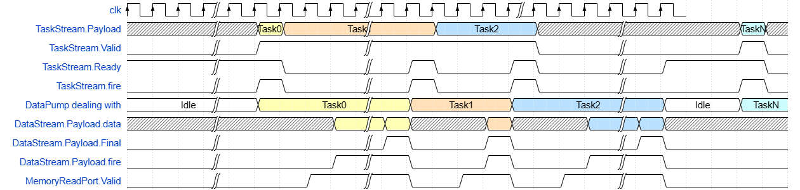
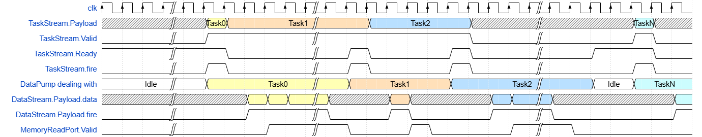

### DataPump_mm2s

MM2S:(Memory-Map to Stream),将数据从指定Address的存储模块中连续取出，转换为Stream类型传输给后续模块进行处理。
这个模块会根据输入的TaskStream指令来生成对cache的读取请求，通过MemoryReadPort发送到cache，并将读取到的数据转换为stream类型，从DataStream端发出。

#### 接口

```scala
case class DataPump_mm2s(cfg: DataPump_mm2s_Config) extends Component
{
  val io = new Bundle
  {
    val MemoryReadPort = master(MemoryReadPort_TypeDef(cfg.mem_addr_width, cfg.mem_data_width))
    val TaskStream = slave Stream (Task_Type()) // Assuming that TaskStream.valid will keep until TaskStream.ready is Given
    val DataStream = master(Stream(Data_TypeDef(cfg)))
  }
}
```

- *MemoryReadPort*:

  master(MemoryReadPort_TypeDef(cfg.mem_addr_width, cfg.mem_data_width))

  ```scala
  case class MemoryReadPort_TypeDef(AddressWidth:Int,DataWidth:Int) extends Bundle with IMasterSlave
  {
    val Valid=Bool()  // 标识读取操作是否有效的信号
    val Address=UInt(AddressWidth bits)  // 内存地址信号，宽度由AddressWidth参数决定
    val Data = Bits(DataWidth bits)  // 读取的数据信号，宽度由DataWidth参数决定
    /**
    * 配置端口为Master角色
    * 这里将Valid和Address设置为输出，Data设置为输入
    */
    override def asMaster(): Unit ={
        out(Valid,Address)
        in(Data)
    }
    /**
    * 配置端口为Slave角色
    * 这里将Valid和Address设置为输入，Data设置为输出
    */
    override def asSlave(): Unit = {
        in(Valid,Address)
        out(Data)
    }
  }
  ```

  注意:此处设置为master也就是相当于调用了这个类的asMaster()方法。
- *TaskStream*

  slave Stream (Task_Type())

  ```scala
  case class Task_TypeDef(cfg: DataPump_mm2s_Config) extends Bundle
  {
    val StartAddr = UInt(cfg.mem_addr_width bits)//起始地址
    val ValidNum = cfg.Enable_Padding_logic generate UInt(cfg.RepeatNum_width bits)
    val data_to_Pad = cfg.Enable_Padding_logic generate Bits(cfg.mem_data_width bits)
    // 如果填充逻辑被使能则这个ValidNum是代表该任务的有效位数，生成ValidNum个内存请求。无效但依然Repeat的位会被自定义值(data_to_Pad)填充
    val RepeatNum = UInt(cfg.RepeatNum_width bits) // 传输元素个数。不填充0的情况下，所有的repeat位默认都是有效的
    val Offset = UInt(cfg.mem_addr_width bits) // 每一个元素的地址偏移。will add offset to adder per repeat
    ...//后面的函数是用来初始化寄存器的
  }
  ```
- *DataStream*

  master(Stream(Data_TypeDef(cfg)))

  ```scala
  case class Data_TypeDef(cfg: DataPump_mm2s_Config) extends Bundle
  {
    val data = Bits(cfg.mem_data_width bits)
    val Final = Bool()
  }
  ```

  这些接口的时序：
  
### DataPump_s2mm

用于驱动数据为带反压的Stream类型。

S2MM:(Stream to Memory-Map),将Stream中的数据存储到存储模块中的指定的地址

#### 接口

```scala
case class DataPump_s2mm(cfg: DataPump_s2mm_Config) extends Component
{
  val io = new Bundle
  {
    val MemoryWritePort = master(MemoryWritePort_Type())
    val TaskStream = slave Stream (Task_Type())// Assuming that TaskStream.valid will keep until TaskStream.ready is Given
    val DataStream = slave Stream (Data_Type())
    val ErrorPort = cfg.Enable_Error_Port_logic generate out(Error_TypeDef(cfg))
  }
}
```

- *MemoryWritePort*

  master(MemoryWritePort_Type())

  ```scala
  case class MemoryReadPort_TypeDef(AddressWidth:Int,DataWidth:Int) extends Bundle with IMasterSlave
  {
    val Valid=Bool()  // 标识读取操作是否有效的信号
    val Address=UInt(AddressWidth bits)  // 内存地址信号，宽度由AddressWidth参数决定
    val Data = Bits(DataWidth bits)  // 读取的数据信号，宽度由DataWidth参数决定
    /**
    * 配置端口为Master角色
    * 这里将Valid和Address设置为输出，Data设置为输入
    */
    override def asMaster(): Unit ={
        out(Valid,Address)
        in(Data)
    }
    /**
    * 配置端口为Slave角色
    * 这里将Valid和Address设置为输入，Data设置为输出
    */
    override def asSlave(): Unit = {
        in(Valid,Address)
        out(Data)
    }
  }
  ```

  注意:此处设置为slave也就是相当于调用了这个类的asSlave()方法。
- *TaskStream*

  slave Stream (Task_Type())

  ```scala
  case class Task_TypeDef(cfg: DataPump_s2mm_Config) extends Bundle {
    val StartAddr = UInt(cfg.mem_addr_width bits)
    val ValidNum = cfg.Enable_UnPadding_logic generate UInt(cfg.RepeatNum_width bits)
    // 如果使能除去无效位的逻辑,则这个ValidNum代表该任务的有效数据包数目，生成ValidNum个内存请求。无效但依然Repeat的位会被舍弃
    val RepeatNum = UInt(cfg.RepeatNum_width bits)
    val Offset = UInt(cfg.mem_addr_width bits) // 不填充0的情况下，所有的repeat位默认都是有效的
    ...//后面的函数是用来初始化寄存器的
  }
  ```
- *DataStream*

  ```scala
  case class Data_TypeDef(cfg: DataPump_s2mm_Config) extends Bundle
  {
    val data = Bits(cfg.mem_data_width bits)
    val Final = Bool()
  }
  ```
- *ErrorPort*

  cfg.Enable_Error_Port_logic generate out(Error_TypeDef(cfg))

  ```scala
  case class Error_TypeDef(cfg: DataPump_s2mm_Config) extends Bundle
  {
    val Not_Valid_and_Not_Zero = cfg.Enable_UnPadding_logic generate Bool()
    val Wrong_DataStream_Final = Bool()
  }
  ```

  仅当cfg中的Enable_Error_Port_logic设为True时会生成这个接口。

  - *Not_Valid_and_Not_Zero*

    仅当cfg中的Enable_UnPadding_logic设为True时会生成这个错误位

    当TaskStream中所规定的Task信息中的ValidNum计数器已经溢出，但DataStream依然接受到了非零的Data，就会报错误
  - *Wrong_DataStream_Final*

    组合逻辑：

    ```scala
    io.ErrorPort.Wrong_DataStream_Final:=
        (((fsm.counter === 1)&&(io.DataStream.fire)&&(io.DataStream.payload.Final===False))
      ||((fsm.counter =/= 1)&&(io.DataStream.fire)&&(io.DataStream.payload.Final===True)))
    ```

  这个逻辑做完之后发现没啥用

这些接口的时序：
