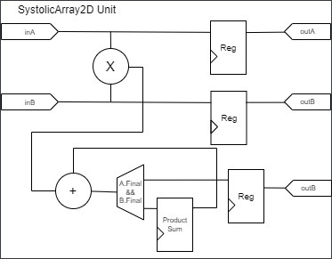
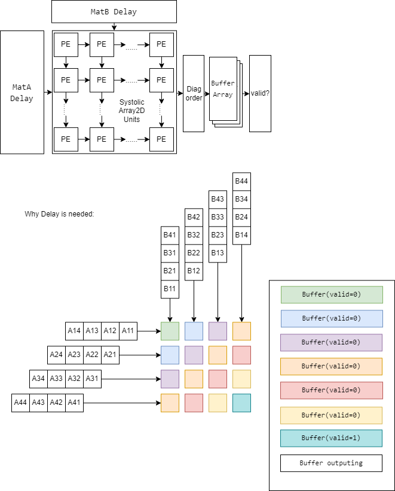
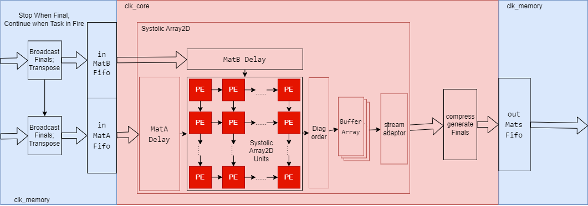

# SystolicArray2D

This is a 2D systolic array which take Matix A(in_MatA_row_num,in_Length) and transposed Matrix B(in_MatB_col_num,in_Length) as input and output Matrix Z(in_MatA_row_num,in_MatB_col_num) result of matrix multiplication.

## SystolicArray2DUnit
SystolicArray2DUnit is one Unit of systolic array 2D
### Diagram


### Parameters
parameters which is needed to configure the module is listed below:
```scala
case class SystolicArray2DUnit_Config
(
  in_Length   : Int,  // number of input data
  inA_Width   : Int,
  inB_Width   : Int,
  outZ_Width  : Int
)
```
### interface
Hardware interface of the module is listed below:
```scala
case class SystolicArray2DUnit(cfg: SystolicArray2DUnit_Config) extends Component {
  val io = new Bundle {
    val inA = in SInt(cfg.inA_Width bits)
    val inA_Final = in Bool()
    val inB = in SInt(cfg.inB_Width bits)
    val inB_Final = in Bool()
    val Go = in Bool()//当上下游拥塞是暂停数据的传递和计算
    val outA= out(Reg(SInt(cfg.inA_Width bits))) init 0
    val outA_Final = out(Reg(Bool())) init False
    val outB= out(Reg(SInt(cfg.inB_Width bits))) init 0
    val outB_Final = out(Reg(Bool())) init False

    val outZ = out(Reg(SInt(cfg.outZ_Width bits))) init 0
    
  }
}
```

## SystolicArray2D
SystolicArray2D is a systolic array to calculate the multiplication of two matrix
### Diagram

### Parameters
parameters which is needed to configure the module is listed below:
```scala
case class SystolicArray2D_Config(
    in_Length_Max: Int, // 最大的乘加次数，譬如要计算A(32,16)*B(16,64),此时乘加的次数就是16
    in_Length_Min: Int,// 最少的乘加次数,用于计算出缓存阵列结果所需的缓存数量
    in_MatA_row_num: Int, // 一个周期从A侧输入的数的数量，也就是输入的A矩阵的行数
    in_MatB_col_num: Int, // 一个周期从B侧输入的数的数量，也就是输入的B矩阵的列数
    // 这两个值也决定了整个脉动整列的尺寸
    in_MatA_element_Width: Int, // 输入的A矩阵的每个数的位宽
    in_MatB_element_Width: Int, // 输入的B矩阵的每个数的位宽
    out_MatZ_element_Width: Int
)
```
### interface
Hardware interface of the module is listed below:
```scala
case class SystolicArray2D(cfg: SystolicArray2D_Config) extends Component {
    case class SInt_withFinalMark(element_Width: Int) extends Bundle {
        /// 定义一个名为data的signed integer变量，它的位宽度由参数element_Width指定。
        val data = SInt(element_Width bits)
        /// 定义一个名为Final的布尔变量，用于标记这是不是一系列数据中的最后一个。
        val Final = Bool()
        }
    case class in_Mats_TypeDef(cfg: SystolicArray2D_Config) extends Bundle {
        // 矩阵A输入线，根据配置信息填充一维向量，向量长度为矩阵A的行数，每个元素为SInt_withFinalMark
        val A = Vec.fill(cfg.in_MatA_row_num)(SInt_withFinalMark(cfg.in_MatA_element_Width))
        // 初始化矩阵B，根据配置信息填充一维向量，向量长度为矩阵B的列数，每个元素为SInt_withFinalMark
        val B = Vec.fill(cfg.in_MatB_col_num)(SInt_withFinalMark(cfg.in_MatB_element_Width))
    }
    val io = new Bundle {
        val in_Mats = slave(Stream(in_Mats_Type())).addAttribute("DONT_TOUCH = \"TRUE\"")
        val out_Mats = master(Stream(out_Mats_Type())).addAttribute("DONT_TOUCH = \"TRUE\"")
    }
}
```

## SystolicArray2D_CC

This module adds a cross-clock domain FIFO at the head and tail of the SystolicArray2D, and adjusts the input and output:

Input: The Final data line for each data line is reduced to one line

Output: The output result of the SystolicArray2D is compressed according to the in_Length_Min, and the output bit width is reduced (the cost is that the output result that was originally output in one clock cycle is output in in_Length_Min clock cycles).

该模块就是在SystolicArray2D的头尾加上了跨时钟域的FIFO,并且调整了输入输出：

输入：每个数据线都配套一根的Final数据线缩减为一根

输出：按照SystolicArray2D输出结果按照in_Length_Min压缩输出位宽（代价则是将原本一个时钟周期输出的结果降低到了in_Length_Min个时钟周期输出完毕）

### Diagram

### Parameters
parameters which is needed to configure the module is listed below:
```scala
case class SystolicArray2D_CC_Config(
    // SystolicArray2D_Config
    in_Length_Max: Int, // 最大的乘加次数，譬如要计算A(32,16)*B(16,64),此时乘加的次数就是16
    in_Length_Min: Int = 1, // 最少的乘加次数,用于计算出缓存阵列结果所需的缓存数量

    in_MatA_row_num: Int = 12, // 一次性从A侧输入的数的数量，也就是输入的A矩阵的行数
    in_MatB_col_num: Int = 24, // 一次性从B侧输入的数的数量，也就是输入的B矩阵的列数
    // 这两个值也决定了整个脉动整列的尺寸
    in_MatA_element_Width: Int = 8, // 输入的A矩阵的每个数的位宽
    in_MatB_element_Width: Int = 8, // 输入的B矩阵的每个数的位宽
    out_MatZ_element_Width: Int = 8,// 输出的Z矩阵的每个数的位宽

    // FIFO的配置
    in_FIFO_Depth: Int = 16,
    out_FIFO_Depth: Int = 8,//指缓存多少位结果，实际的内存深度会再乘以in_Length_Min，而内存宽度会除以in_Length_Min。
)
```
### interface
Hardware interface of the module is listed below:
```scala
case class SystolicArray2D_CC(cfg: SystolicArray2D_CC_Config,    
// 时钟域
    clk_in: ClockDomain=ClockDomain.external("SystolicArray2D_CC_in"),//和输入数据的Stream接口和fifo相连
    clk_out: ClockDomain=ClockDomain.external("SystolicArray2D_CC_out"),//和输出数据的fifo和输出数据的Stream接口相连
    clk_core: ClockDomain=ClockDomain.external("SystolicArray2D_CC_core")//驱动脉动阵列SystolicArray2D
    ) extends Component {
  case class in_Mats_TypeDef(cfg: SystolicArray2D_CC_Config) extends Bundle {
    val A = Vec.fill(cfg.in_MatA_row_num)(SInt(cfg.in_MatA_element_Width bits))
    val B = Vec.fill(cfg.in_MatB_col_num)(SInt(cfg.in_MatB_element_Width bits))
    val Final = Bool()
  }
  def in_Mats_Type():in_Mats_TypeDef={new in_Mats_TypeDef(cfg)}
  case class out_Mats_TypeDef(cfg: SystolicArray2D_CC_Config) extends Bundle {
    val Z = Vec.fill(cfg.out_MatZ_Width)(SInt(cfg.out_MatZ_element_Width bits))
    val Final = Bool()
  }
  def out_Mats_Type():out_Mats_TypeDef={new out_Mats_TypeDef(cfg)}
  val io = new Bundle {
    val in_Mats = slave(Stream(in_Mats_TypeDef(cfg))).addAttribute("DONT_TOUCH = \"TRUE\"")
    val out_Mats = master(Stream(out_Mats_TypeDef(cfg))).addAttribute("DONT_TOUCH = \"TRUE\"")
  }
}
```

