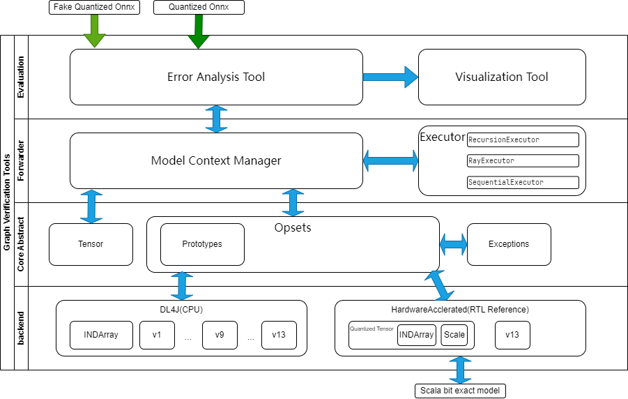
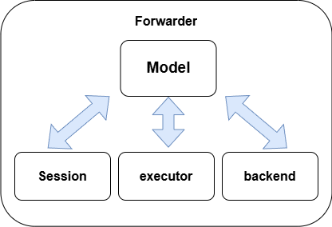
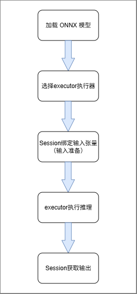
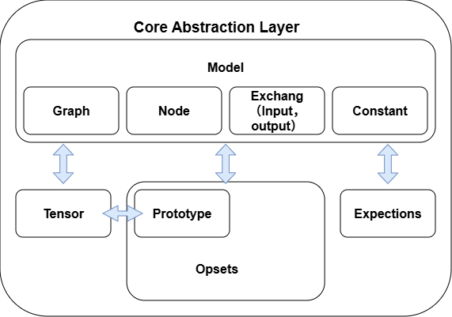
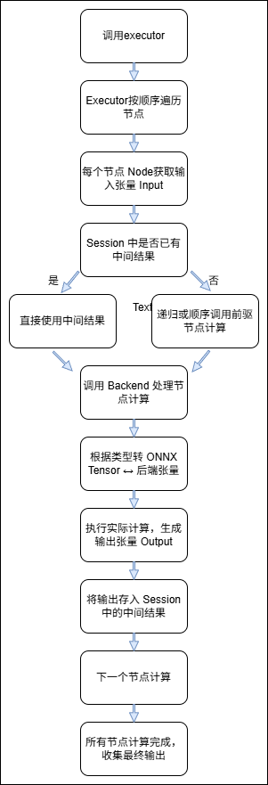

# 软件文档（以 modelTest 测试流程为核心）

本项目的软件部分基于 **Forwarder Framework**，用于统一加载 ONNX 模型、执行推理计算、保存中间结果，并验证算子正确性。  
系统通过抽象层、算子层、后端层、执行器层分层设计，并通过一个完整的 **`modelTest()` 测试流程**，覆盖了整个软件栈的所有核心模块。

---

## 🧩 软件总体结构

软件由以下四层构成：

| 层级 | 说明                                                                                |
|------|-----------------------------------------------------------------------------------|
| **误差分析层 <br/>(Evaluation Layer)** | 负责分析不同计算后端推理同一模型时同名张量之间的误差，识别手动实现的问题，实现设计迭代闭环。<br/>包含 `FWTestCase` 和 `ModelTest`等 |
| **推理会话层 <br/>(Forwarder Layer)** | 负责创建特定计算图在特定计算后端上的推理会话，实现输入加载、推理执行、中间结果保存和输出验证，提供统一的后端接口。                      |
| **核心抽象层 <br/>(Core Abstraction Layer)** | 基于ONNX标准提供统一的模型和张量管理接口，实现模型加载、输入绑定、拓扑排序和资源管理，支持多种后端透明切换。                                  |
| **后端实现层 <br/>(Backend Layer)** | 执行实际计算并将抽象层数据类型转换为后端支持格式，支持DL4J和FPGA推理后端，提供统一的算子接口，确保计算正确性和性能优化。                            |




---
# 推理会话层 (Forwarder Layer)

参考代码路径：/home/user/Workspace/livehps_1/sw/java/main/java/org/forwarder

## 概述
Forwarder 层是一套基于 ONNX4J 抽象层 衍生出来的推理会话框架。  
负责创建特定计算图在特定计算后端上的推理会话，实现输入加载、推理执行、中间结果保存和输出验证，提供统一的后端接口。  
Forwarder 层建立在 ONNX 抽象层之上，负责：
- 加载 ONNX 模型，构建 Forwarder 层的 `Model` 数据结构；
- 创建推理会话 `Session`，管理输入输出；
- 调用执行器 `Executor` 调度计算图执行；
- 封装模型推理流程，让用户无需关注计算图与拓扑结构。


Forwarder 层核心组成：

| 模块 | 职责 |
|------|------|
| `Forwarder` | 用户入口，负责加载模型和创建会话 |
| `Model` | 保存 ONNX 模型的计算图结构（节点、输入、输出等） |
| `Session` | 管理输入输出、中间结果，并调度执行器执行计算 |
| `Executor` | 遍历 / 拓扑排序计算图，调度每个节点执行算子 |

---
## 架构



其中backend会在后面的后端实现层介绍

---
## 执行流程图


---
## 核心类说明
```text
Forwarder
│
└── Model                           // 封装了 ONNX 模型+执行器+后端管理
     ├── Executor   (抽象执行器)
     │     ├── RecursionExecutor  // 递归执行，不提前排序
     │     ├── RayExecutor        // 拓扑排序（输出 -> 输入方向 BFS）
     │     └── SequentialExecutor // 拓扑排序（DFS + 检测循环）
     ├── Session                   // 保存中间输出
     └── Backend //在之后后端实现层再具体介绍
```
---
### 1. Forwarder (入口)
负责加载 ONNX 模型、注册 Backend、管理模型
```java
public class Forwarder {
    private static final Map<String, Model> modelSet = new ConcurrentHashMap<>();
    /**
     * 加载 ONNX 模型文件到 Model 实例。
     *
     * Input:
     *  @param onnxModelPath  - 模型路径
     *  @param config         - 推理配置
     *
     * Output:
     *  @return Model         - 已加载的模型实例
     */
    public static Model load(String onnxModelPath, Config config);
    
    public static Set<String> installedBackends();
}
```
---
### 2. Model —— ONNX 模型与 Executor 管理者
- **作用**：表示一个加载的 ONNX 模型，负责管理执行器和后端实例。
- **核心方法**：
    - `executor(Class<? extends Executor> classOfExecutor)`：初始化执行器。
    - `backend(String name)`：获取或创建指定后端实例。
    - `getExecutor()` / `getConfig()` / `getId()`：获取执行器、配置、模型 ID。
    - `close()`：释放所有后端资源并清理模型引用。
```java
public Model executor(Class<? extends Executor> classOfExecutor) throws NoSuchMethodException, SecurityException,
        InstantiationException, IllegalAccessException, IllegalArgumentException, InvocationTargetException {
    this.executor = ExecutorFactory.createInstance(this, classOfExecutor);
    return this;
}
//Executor 不是 Forwarder 创建的，而是 Model 中动态注入的
public Backend<?> backend(String name) throws NoSuchMethodException, SecurityException, InstantiationException,
        IllegalAccessException, IllegalArgumentException, InvocationTargetException {
    if (this.backends.containsKey(name)) {
        return this.backends.get(name);
    } else {
        Backend<?> backend = BackendFactory.createInstance(name, this);
        assert backend != null;
        this.backends.put(name, backend);
        return backend;
    }
}//获取backend
```

---

### 3. Session<T_BK_TS>
- **作用**：一次完整的模型推理会话，负责输入绑定、前向推理、输出处理和中间结果管理。 
    每次推理只能使用一次 Session，不同 Session 之间相互隔离，线程安全。
- | 职责 | 说明 |
  |------|------|
  | 输入绑定 | 接收用户输入并写入中间结果存储区 |
  | 执行推理 | 调用 `Executor.execute()` 执行 ONNX 图 |
  | 中间结果管理 | 保存每个节点执行后的张量 |
  | 输出返回 | 返回模型最终输出结果（Tensor / Backend tensor） |
  | 资源管理 | 推理完成后释放 Backend 内存 |
- **核心流程**：
    1. **绑定会话**：
        - 每个线程使用 `ThreadLocal<Session<?>>` 绑定独立会话，确保线程安全。
    2. **输入准备**：
        -  `feed(String name, Tensor tensor, boolean autoAttach)`
            - 检查输入名称是否存在于 `GraphInput`
            - 检查数据类型和 shape 是否匹配
            - 转换为后端张量 `T_BK_TS` 并存入 `intermediateOutputs`
            - 可选择将前端 `Tensor` 存入 `exchangeTensorManager`
    3. **前向推理**：
        - 调用 `forward()`
            - 将后端常量张量加入中间结果集合
            - 获取 `Executor` 并执行 `executor.execute(this, backend.getOpsets())`
            - 将后端张量转换为前端 `Tensor` 并封装到 `Outputs`
    4. **获取输出**：
        - `getOutput(String name)`：前端 Tensor 输出
        - `getIntermediateOutput(String name)`：后端张量
        - `getIntermediateOutputTensor(String name)`：后端张量转换为前端 Tensor
    5. **资源释放**：
        - `close()`：释放中间张量管理器、交换张量管理器，并解除线程绑定

---
### 4. Executor (执行器)
- **核心职责：**
    - 负责解析 ONNX 模型的图结构；
    - 确定节点（Node）的执行顺序；
    - 调用相应的算子实现执行每个节点；
    - 维护中间结果的传递；
    - 将最终结果返回给 Session。

执行器层的关键点是**如何遍历并调度 ONNX 图中的节点**。  
为此，框架中提供了三种不同的执行策略：

| 类名 | 执行策略 | 特点 |
|------|------------|------|
| `RecursionExecutor` | 递归执行 | 自顶向下递归遍历依赖图 |
| `RayExecutor` | 拓扑排序 + 反向回溯 | 从输出节点反向遍历前驱节点 |
| `SequentialExecutor` | 拓扑排序 + 正向执行 | 预先排序所有节点后依次执行（推荐） |

---

执行器层的基础类是：

```java
package org.forwarder.executor;
public abstract class Executor<T_BK_TS> {
    protected Model model;

    public Executor(Model model) {
        this.model = model;
    }
    public abstract void execute(Session<T_BK_TS> session, OperatorSets opsets);
}
```
所有具体执行器（如 SequentialExecutor、RayExecutor 等）都继承该类，并实现 execute 方法。

---
#### (1)ExecutorFactory
负责根据模型创建指定类型的执行器实例。
```java
package org.forwarder.executor;
import java.lang.reflect.Constructor;
import org.onnx4j.Model;
public class ExecutorFactory {

    public static Executor<?> createInstance(Model model, Class<? extends Executor> classOfExecutor)
            throws Exception {
        Constructor<? extends Executor> c = classOfExecutor.getConstructor(Model.class);
        return c.newInstance(model);
    }
}
```

---
#### (2)RecursionExecutor
递归执行，无拓扑排序

优点：实现简单
缺点：深度计算图可能导致栈溢出
```java
@Override
public void execute(Session<T_BK_TS> session, OperatorSets opsets) {
    for (GraphOutput graphOutput : super.model.getGraph().getOutputs()) {
        this.handle(session, opsets, graphOutput.getNode());
    }
}

private void handle(Session<T_BK_TS> session, OperatorSets opsets, Node node) {
    for (String inputName : node.getInputNames()) {
        T_BK_TS inputTensor = session.getIntermediateOutput(inputName);
        if (inputTensor == null) {
            for (Node predecessor : super.model.getGraph().predecessors(node)) {
                this.handle(session, opsets, predecessor);
            }
        }
    }
    super.handle(session, opsets, node, inputs);
}//递归
```
---
#### (3)RayExecutor
使用拓扑结构保证节点按依赖顺序执行。

它从输出节点反向追踪所有依赖（前驱节点），形成一个有序的执行序列。
```java
@Override
public void execute(Session<T_BK_TS> session, OperatorSets opsets) {
    for (Node node : this.orderedSequenceNodes) {
        this.handle(session, opsets, node);
    }
}
```
执行流程：

1.调用 toOrderedSequenceNodes() 获取拓扑排序后的节点序列；

2.依次执行每个节点；

3.将每个节点的输出存入 session 的中间结果中；

4.后续节点从 session 获取输入张量。
```java
private Collection<Node> toOrderedSequenceNodes(Graph graph) {
    Collection<Node> nodes = new LinkedList<Node>();
    for (GraphOutput graphOutput : graph.getOutputs()) {
        this.predecessors(nodes, graph, graphOutput.getNode());
        this.addOrderedSequenceNode(nodes, graphOutput.getNode());
    }
    return nodes;
}
```
predecessors() 方法递归追踪前驱节点并存储访问顺序，从而生成拓扑序列。

---
#### (4)SequentialExecutor

是当前框架中最稳定、可控的执行方式。

它首先对模型图进行拓扑排序（防止循环依赖），然后按正向顺序依次执行节点。
```java
@Override
public void execute(Session<T_BK_TS> session, OperatorSets opsets) {
    for (Node node : this.orderedSequenceNodes) {
        this.handle(session, opsets, node);
    }
}
```
在执行过程中：

每个节点执行前，会从 session 中取出输入；

每个节点执行后，输出张量会重新写入 session；

执行顺序严格遵守依赖拓扑。

拓扑排序算法实现：
```java
private void topologicalSortUtil(Node node, Graph graph, LinkedList<Node> orderedNodes,
                                 Set<Node> visited, Set<Node> recursionStack) {
    visited.add(node);
    recursionStack.add(node);
    Collection<Node> predecessors = graph.predecessors(node);
    if (predecessors != null) {
        for (Node predecessor : predecessors) {
            if (recursionStack.contains(predecessor)) {
                throw new IllegalStateException("Graph has a cycle, topological sort not possible.");
            }
            if (!visited.contains(predecessor)) {
                topologicalSortUtil(predecessor, graph, orderedNodes, visited, recursionStack);
            }
        }
    }
    recursionStack.remove(node);
    orderedNodes.add(node);
}
```

---

### 5. Config
- **作用**：模型和会话的配置管理，使用 Builder 模式初始化。
- **配置项**：
    - 执行器类型 `executor`（默认 `RayExecutor`）
    - 张量分配模式 `AllocationMode`
    - 内存字节序 `ByteOrder`
    - 调试开关 `isDebug`
- **方法**：
    - `getTensorOptions()`：生成 Tensor 初始化选项
    - `getExecutor()` / `isDebug()` / `getMemoryAllocationMode()` / `getMemoryByteOrder()`


---
## 核心流程

Forwarder层的完整流程如下：

1. **加载模型**
    - 使用 `Forwarder.load(onnxModelPath, config)` 加载 ONNX 模型。
    - 返回 `Model` 实例，并注册到全局 `modelSet` 中。
    - 核心动作：
        - 解析 ONNX 模型结构
        - 初始化模型的默认执行器
        - 准备算子集合（Opsets）
```java
Model loadedModel = forwarder.load(absoluteModelPath,cfg).executor(SequentialExecutor.class); //FWTestCase.java
```
```java
public static Model load(String onnxModelPath, Config config) {
String modelId = UUID.randomUUID().toString();
Model model = new Model(modelId, onnxModelPath, config);
modelSet.putIfAbsent(modelId, model);
return model;//Forwarder.java
}
```
2. **准备输入**
    - 在 `Session` 中使用 `feed()` 方法绑定输入张量。
    - 输入张量验证：
        - 名称必须在模型计算图中定义
        - 数据类型和形状必须匹配
    - 输入张量会被转换为后端原生张量，并存入中间结果缓存
```java
session.feed(input, false);  //FWTestCase.java
```
```java
public Session<T_BK_TS> feed(String name, Tensor tensor, boolean autoAttach) {
    //获取计算图的输入
    GraphInput graphInput = this.backend.getModel().getGraph().getInputs(name);
    if (graphInput == null) {
        throw new IllegalArgumentException(String.format("Input named \"%s\" had not be defined in graph", name));
    } else {
        //检查输入的tensor的dataType和shape是否和网络定义的一致
        if (!tensor.equals(graphInput.getValueInfo())) {
            throw new IllegalArgumentException(
                    String.format("Shape or DataType is not equals to the input tensor named \"%s\" ", name));
        }
    }
    //转换为后端原生数据类型T_BK_TS
    T_BK_TS backendTensor = this.backend.toBackendTensor(this.intermediateTensorManager, tensor);
    //将输入作为中间结果存入一个map中，用name作为key
    this.intermediateOutputs.put(name, backendTensor);
    //默认会把输入的Tensor类型也存起来
    if (autoAttach) {
        this.exchangeTensorManager.attach(name, tensor);
    }
    return this;
}//Session.java
```

3. **执行推理**
    - 调用 `Session.forward()`：
        - 将常量张量加载到会话
        - 通过执行器递归执行算子
        - 逐步更新中间结果
    - 计算完成后，输出张量会被转换回前端 `Tensor` 类型，封装到 `Outputs` 中
```java
session.forward(); //FWTestCase.java
```
```java
public Session<T_BK_TS> forward() {
    this.intermediateOutputs.putAll(this.backend.getTensorManager().get());

    //从后端获取执行器
    Executor<T_BK_TS> executor = this.backend.getModel().getExecutor();
    //递归执行推理
    executor.execute(this, this.backend.getOpsets());
    // 处理输出：将后端张量转换回前端Tensor并封装为输出结果
    for (GraphOutput graphOutput : this.backend.getModel().getGraph().getOutputs()) {
        T_BK_TS backendTensor = this.intermediateOutputs.get(graphOutput.getName());//从中间结果获取所有名字和网络需要的输出一致的张量
        Tensor tensor = this.backend.toNativeTensor(this.exchangeTensorManager, graphOutput.getName(),
                backendTensor);//转换回Tensor类型
        Output output = Output.wrap(graphOutput.getName(), tensor);//封装为输出对象并存入结果集
        outputs.append(graphOutput.getName(), output);
    }
    return this;
}//Session.java
```


4. **获取输出**
    - 使用 `Session.getOutput(name)` 获取最终输出张量
    - 可获取单个输出或所有输出
    - 支持获取中间计算结果：
        - `getIntermediateOutput(name)` 返回后端类型
        - `getIntermediateOutputTensor(name)` 返回前端 `Tensor`

5. **资源释放**
    - 会话实现 `AutoCloseable`，使用 `close()` 方法释放：
        - 中间张量管理器
        - 交换张量管理器
        - 会话线程本地绑定
    - 模型关闭会自动释放相关后端资源

---
# 核心抽象层 (Core Abstraction Layer)
参考代码路径：sw/java/main/java/org/onnx4j

## 一. 简介
ONNX4J 抽象层是整个 ONNX4J 项目的核心，负责：
- 描述 ONNX 模型图结构（DAG）；
- 管理张量数据及内存；
- 提供算子（Opsets）抽象接口；
- 异常处理。

抽象层 不执行模型推理，推理逻辑由上层Forwarder层中 Executor / Session 处理。

ONNX4J 的抽象层主要负责把 ONNX 模型转换成可以操作的内部结构，并管理张量数据和算子信息，让上层推理引擎可以专注于计算逻辑。

模块划分：

| 模块 | 说明                                                       |
|------|----------------------------------------------------------|
| `tensor` | 张量数据及管理（Tensor.java、TensorManager.java）                  |
| `model` | 模型内部结构（Graph.java、Node.java、Exchange.java、Constant.java） |
| `prototype` | ONNX Proto 数据结构（OnnxProto3、OnnxOperatorsProto3）          |
| `opsets` | 算子注册表与抽象接口（OperatorSetId、Operator）                       |
| `exceptions` | 异常处理（ModelException等）                                     |



---
## 二. 框架流程

1. **加载模型**
    - 通过 `Model` 类加载 ONNX 模型文件（`.onnx`）或 Proto 对象；
    - 检查 IR 版本是否在支持范围内；
    - 初始化 TensorManager 以管理张量内存。

2. **构建计算图**
    - `Model` 内部创建 `Graph` 对象；
    - 遍历模型节点（NodeProto），创建 `Node` 对象；
    - 构建 DAG（有向无环图），确定节点之间的依赖关系；
    - 初始化输入（GraphInput）、输出（GraphOutput）和常量（Constant）。

3. **管理张量**
    - Tensor 对象封装数据类型、形状和内存；
    - TensorManager 负责生命周期管理（创建、释放）；
    - TensorOptions 可指定内存分配方式（DIRECT 或 HEAP）和字节序。

4. **执行计算（推理）**
    - 上层推理引擎通过 Graph 获取节点信息和张量数据；
    - 根据节点依赖顺序执行计算；
    - 输出结果由 GraphOutput 或 Constant 获取。

5. **释放资源**
    - 调用 `Model.close()`，TensorManager 会释放所有张量；
    - 避免内存泄漏。

---
## 三. 类介绍

### 1. Model
- 模型入口类，加载 `.onnx` 文件或 Proto 对象；
- 管理 IR 版本、模型版本、算子集（Opset）和 Graph；
- 提供 TensorManager，用于管理模型运行时的张量内存。

```java
Model model = new Model();
Graph graph = model.getGraph();           // 获取计算图
TensorManager<Tensor> manager = model.getTensorManager(); // 管理张量
```

### 2. Graph
- 表示模型的计算图；
- 包含所有 Node、输入（GraphInput）、输出（GraphOutput）和常量（Constant）；
- 构建 DAG 来确定节点计算顺序；
- 提供方法获取节点的前驱（predecessors）和后继（successors）。
```java
Node node = graph.getNode();
Set<Node> prev = graph.predecessors(node); // 获取前驱节点
Set<Node> next = graph.successors(node);   // 获取后继节点
```

### 3 Node
- 图中的计算单元，代表一个算子操作；
- 包含 `opType`、`domain`、输入输出名称、属性（Attributes）；
- 可通过 `getGraph()` 获取所属 Graph。

实例
```java
Node conv = graph.getNode("Conv_0");
String opType = conv.getOpType();         // "Conv"
String[] inputs = conv.getInputList();   // ["input_0", "weight"]
Attributes attrs = conv.getAttrs();       // 获取节点属性
```

### 4 Exchange（抽象类）
- GraphInput 和 GraphOutput 的父类；
- 封装数据信息（ValueInfo），包括类型和形状。

实例
```java
GraphInput input = graph.getInputs("input_0");
ValueInfo info = input.getValueInfo(); // 数据类型和形状
```

### 5 Constant
- 模型中的常量节点；
- 封装 Tensor 对象，运行时不需要外部输入。
- 常用于权重或固定参数。

### 6 Tensor
- 封装张量数据，包括数据类型、形状和 ByteBuffer；
- 提供只读数据访问、元素数量查询和内存占用查询。

获取张量名称：getName()

获取数据类型：getDataType()

获取形状信息：getShape()

获取实际数据：getData()

获取元素总数量：getElementSize()

获取内存占用：getMemoryBytes()

支持 AutoCloseable 接口，通过 close() 释放资源


### 7 TensorManager
- 抽象类，用于管理张量生命周期；
- 负责张量的 attach、detach 和释放操作；
- 实现 AutoCloseable 接口，可安全释放资源。

attach(String name, T_TS tensor)：将张量注册到管理器

detach(String name)：注销张量

get(String name)：根据名称获取张量

示例：
```java
tensorManager.attach("conv_weight", tensor);
Tensor t = tensorManager.get("conv_weight");
```

### 8.Prototype
- 定义Tensor的形状和数据类型，记录结构信息但不储存真实数据
- 连接模型与具体Tensor数据


### 9. Opsets
Opsets（操作集合）表示模型中使用的所有节点操作类型及其版本。在 ONNX 模型中，每个节点都属于某个操作（比如卷积、加法等），而 Opsets 记录了这些操作对应的版本信息。  
在 ONNX4J 中，`Model` 类使用 `OperatorSetId[] opsetIds` 保存 Opsets 信息。
- 功能：保证模型中每个节点的操作在 ONNX 支持的版本范围内，避免节点无法执行或版本不兼容的情况。

### 10. Exceptions
Exceptions（异常）用于处理模型加载、解析和验证过程中出现的错误。

功能：
- `Onnx4jException` 是所有 ONNX4J 异常类的基类。 子类包括 `ModelException`、`TensorException`、`OperatorException`、`GraphException`。
- `ModelException` 是在模型加载和检查过程中抛出的异常类。 用于处理模型文件不存在、IR 版本不支持等情况。
- `TensorException` 是在张量操作或节点属性处理过程中抛出的异常类。 用于处理张量相关的错误，如节点输出的值信息不存在或不支持的属性类型。
- `OperatorException` 用于节点操作或属性处理的异常。 用于处理节点输出值信息不存在或不支持的属性类型。
- `GraphException` 用于图结构操作过程中的异常。 当图的输入或输出未定义或找不到时抛出。


---
# 后端实现层（Backend Layer）文档
参考代码路径：sw/java/main/java/org/forwarder/backend
## 一、模块概述

**后端实现层（Backend Layer）** 是 Forwarder 框架的底层执行支撑部分，负责模型推理的具体实现与硬件资源调度。

主要的工作是：

- **执行模型计算**：把节点的计算操作交给底层硬件（CPU/GPU/加速器）完成；
- **管理内存**：保证张量在运行过程中有足够的内存，并在完成后释放；
- **支持多后端**：可以根据硬件类型加载不同后端，例如 ND4J 或自定义加速器；
- **张量转换**：在 ONNX 张量和后端张量之间互相转换；
- **可调试和可扩展**：支持调试模式和新的后端接入。
- 
主要组成：
```text
org.forwarder.backend
├─ BackendRegistry      # 注册和管理已安装的 Backend
├─ BackendLoader        # 扫描服务，初始化可用 Backend
├─ BackendFactory       # 根据名称动态创建 Backend 实例
├─ impls.HWAccelerated  # 实现示例：HWAcceleratedBackend + HWAcceleratedSession + DataTypeHelper
```
现在的impls有DL4j和HWAccelerated两种，其中DL4j是所有算子由软件完成实现，HWAccelerated是部分算子由硬件完成实现。


---

## 二、核心组件

### 2.1  Backend<T_TS>
- **作用**：负责实际计算执行和后端资源管理。
- **核心功能**：
    - 通过 `toBackendTensor()` 将前端 Tensor 转为后端张量
    - 通过 `toNativeTensor()` 将后端张量转换回前端 Tensor
    - 管理中间张量 `TensorManager<T_TS>`，负责资源释放
    - 初始化常量张量
    - 创建会话 `newSession()`
    - 获取 Opsets（算子集合）
- **重要方法**：
    - `disposeBackendTensor(T_TS tensor)`：释放后端张量资源
    - `getName()`：后端名称，例如 TensorFlow、DL4J

### 2.2 BackendRegistry

- 单例枚举，用于存储和管理已注册的 Backend 类。
- 功能：
    - 注册 Backend 实例；
    - 根据名称获取 Backend 类；
    - 获取所有已注册 Backend。

```java
public enum BackendRegistry {
    Instance;

    private Map<String, Class<? extends Backend>> backends = new HashMap<>();

    public Class<? extends Backend> get(String backendName) {
        return this.backends.get(backendName);
    }

    public void register(Backend<?> backend) {
        this.backends.put(backend.getName(), backend.getClass());
        logger.info("Backend named \"{}\" has installed", backend.getName());
    }

    public Map<String, Class<? extends Backend>> get() {
        return this.backends;
    }
}
```
---
### 2.3 BackendLoader

负责扫描和初始化所有可用 Backend（基于 ServiceLoader）。

功能：

自动扫描实现了 Backend 接口的服务；

将发现的 Backend 注册到 BackendRegistry；

保证初始化只执行一次。

---
### 2.4 BackendFactory

根据 Backend 名称创建具体 Backend 实例。

功能：

从 BackendRegistry 获取对应 Backend 类；


允许动态加载不同硬件后端。

---
### 2.5 HWAcceleratedBackend

继承自 Backend<INDArray>，提供 ND4J 后端实现。

功能：

把模型里的计算节点交给 ND4J 处理；

提供 Session 来管理内存；

负责 ONNX 张量和 ND4J 张量互转。

---
### 2.6 HWAcceleratedSession

管理 ND4J Workspace 并绑定到 Backend。

功能：

分配和管理内存 Workspace；

绑定当前线程 Session；

关闭时释放资源。

---
### 2.7 HWAcceleratedDataTypeHelper（数据类型转换）

作用：ONNX 张量数据类型 ↔ ND4J 后端张量数据类型的映射。

它的作用是 在 ONNX 张量数据类型和后端（ND4J/HWAccelerated）张量数据类型之间进行映射。

这种数据类型映射是 后端特有的实现细节，与具体算子（Operator/Executable）无关。算子层只关心输入输出张量的类型，但不负责类型转换。

在执行器层（Executor）或算子层调用时，需要先通过后端将 ONNX Tensor 转换为后端张量，或者将后端张量转换回 ONNX Tensor，
HWAcceleratedDataTypeHelper 就是在这个转换过程中使用的工具类。

## 三、后端层总体执行流程



## 四、算子
### 获取 ONNX 算子的实际行为
可参考 ONNX Python 库文档 https://onnx.ai/onnx/intro/python.html


### 已实现的算子
项目支持广泛的ONNX算子，包括但不限于：

| 算子类别 | 支持的算子 |
|---------|-----------|
| 基础数学运算 | Add, Sub, Mul, Div, Exp, Log, Neg |
| 线性代数 | MatMul, GeMM |
| 激活函数 | Relu, Softplus |
| 张量操作 | Reshape, Concat, Slice, Transpose, Expand, Tile |
| 规约操作 | ReduceMax, Max, Sum |
| 比较操作 | Greater, Where |
| 其他 | Cast, Constant, Identity, Shape, Squeeze, Unsqueeze |

### 算子版本支持
项目支持多个ONNX算子集版本（V1-V13），具体支持情况请参考代码中的算子实现。

### 添加onnx标准中已有的新算子的指南

### 步骤概述
1. **添加算子接口**: 在相应的算子集目录中创建接口定义
2. **实现算子逻辑**: 在后端实现中编写具体逻辑
3. **注册算子**: 在算子集初始化器中注册新算子
4. **验证实现**: 运行测试确保算子正确工作
5. **编写测试**: 创建完整的测试用例

### 详细流程
参考项目中的现有算子实现，如Add算子(DL4J)：
- 接口位置: `sw/java/main/java/org/onnx4j/opsets/domain/aiOnnx/v6/ops/AddV6.java`
- 实现位置: `sw/java/main/java/org/forwarder/backend/impls/dl4j/opsets/aiOnnx/v6/ops/DL4JAddV6.java`
- 注册位置: 相应的算子集初始化器文件
